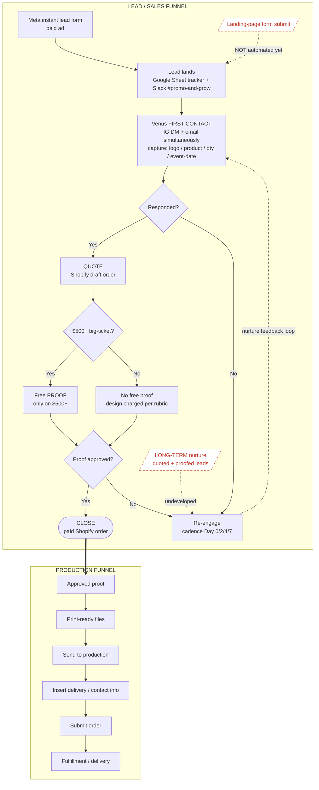

# Production & Lead Funnel (diagram + notes)

**Summary**: A single end-to-end visual of Promo & Grow's live funnel — paid Meta lead → Venus first-contact → Shopify quote → proof → paid order → production backend → delivery — split into a **LEAD/SALES** zone (top) and a **PRODUCTION** zone (bottom). This is a *starting visual + annotations* to build from, **not** a full written plan; Carlos builds the actual funnel. Dashed nodes = gaps to build.

**Type**: concept

**Sources**: this week's live ops (2026-06-28); builds on [[meta-lead-intake-playbook]], [[pipeline-ops-spine]], [[draft-order-quote-system]], [[proof-vs-design-policy]], [[fulfillment-sop]], [[free-proof-landing-page]], [[deal-followup-playbook]].

**Last updated**: 2026-06-28.

---

## The diagram

> Dashed red nodes + dashed arrows = **GAPS / to-build** (see notes). Solid = live this week.

---

## Stage notes

### LEAD / SALES funnel (top)

**1 — Meta instant lead form (paid ad).** Paid Meta UGC ad → native instant lead form (name + email, +phone on the high-intent ad set). **Automated** intake from Meta. Note: the instant form does *not* pass an IG handle — handles come only from people who DM @promongrow directly ([[meta-lead-intake-playbook]]).

**2 — Lead lands (Sheet + Slack).** Lead drops into the **Meta Test Leads Google Sheet** + pings **#promo-and-grow**. **Semi-manual** today — Meta → Sheet is hand-keyed; Slack ping is the live alert. This is the working queue until a lead graduates to Shopify ([[pipeline-ops-spine]]).

**3 — Venus FIRST-CONTACT.** Venus reaches out **IG DM + email simultaneously**, captures the four things an estimate needs: **logo / product / qty / event-date** (+ missing phone/address). **Manual** (Venus). Cadence **Day 0/2/4/7**. This is the speed-to-lead step — #1 close factor.

**4 — Decision: Responded?** If yes → quote. If no → drop into re-engage (the dashed nurture loop back to first-contact). **Manual** judgment by Venus off Sheet status.

**5 — QUOTE (Shopify draft order).** Build the draft order in Shopify off the [[master-price-sheet]] (catalog = set price). **Manual** (Venus; custom jobs route to Carlos). From here the deal lives in Shopify, not the pre-Shopify sheet.

**6 — Decision: $500+ big-ticket?** Routes the proof policy. **$500+** (tents / table covers / flags) → **free proof**. **Sub-$500** (cards / flyers small print) → **no free proof**, design charged per [[design-price-rubric]] ([[proof-vs-design-policy]]). **Manual** gate.

**7 — PROOF approval.** Send proof: *"nothing prints until you approve it."* Approval starts the production clock. **Manual.** Non-approval → back into re-engage loop.

**8 — CLOSE = paid Shopify order.** Customer pays the Shopify order. **Automated** capture (Shopify) once they pay; chase to payment is **manual** ([[deal-followup-playbook]]). This is the handoff trigger into production.

### PRODUCTION funnel (bottom)

**9 — Approved proof → print-ready files.** Approved artwork is taken to production spec (CMYK / dpi / bleed / safe area per [[proof-and-production-templates]]). **Manual** (Carlos / graphxsource interim).

**10 — Send to production.** Files go to the production vendor. **Manual** ([[fulfillment-sop]]).

**11 — Insert delivery / contact info.** Delivery + contact details entered on the order. **Manual.**

**12 — Submit order.** Order submitted to the vendor. **Manual.**

**13 — Fulfillment / delivery.** Product produced and delivered / picked up. **Vendor-run**; Venus/VA tracks status and closes the loop (review ask, reorder).

---

## GAPS / to-build

> These are the dashed-red items in the diagram — Carlos builds; flagged so nothing gets mistaken for "done."

**(a) Landing-page FORM-submission automation — NOT set up.**
The Meta instant form feeds the Sheet, but the website landing-page form ([[free-proof-landing-page]]) is **not wired** to drop submissions into the Sheet / Slack / Shopify. Today a LP submit would be a manual catch (or missed). To-build: form → tracker automation (Zapier candidate — see [[zapier-automation-roadmap]]).

**(b) LONG-TERM nurture for QUOTED + PROOFED leads — undeveloped.**
Venus's cadence covers **Day 0–7 only** (some notes say Day 0–5). Anyone quoted + sent a proof who doesn't close has **no long-term nurture** after week 1 — they currently fall out of active follow-up. To-build: a weekly/biweekly re-engagement sequence for quoted-not-closed leads (the dashed feedback loop in the diagram is the placeholder for it).

**(c) FREE-PROOF policy — needs a phased long-term solution.**
Current rule is **free proof on $500+ only**. That's a working stopgap, not a settled policy — it needs a phased plan (e.g., deposit-against-proof, proof credit applied to order, or tiered proof fees) so free proofs don't become a cost leak as volume scales ([[proof-vs-design-policy]]). To-build: phased proof-policy ladder.

---

## How to read this

- **Two zones**: LEAD/SALES (top) ends at the paid Shopify order; PRODUCTION (bottom) starts from the approved proof. The thick arrow is the handoff.
- **Diamonds** are decision gates: `Responded?` · `$500+?` · `Proof approved?`.
- **Dashed loop** = nurture / re-engage (no-response → back to first-contact).
- **Dashed red nodes** = gaps to build, mapped to the GAPS block above.
- Built **for now** as a build-from visual — refine the nodes as Carlos stands up the real funnel.

## Related pages
- [[meta-lead-intake-playbook]]
- [[pipeline-ops-spine]]
- [[draft-order-quote-system]]
- [[proof-vs-design-policy]]
- [[free-proof-landing-page]]
- [[deal-followup-playbook]]
- [[fulfillment-sop]]
- [[zapier-automation-roadmap]]
